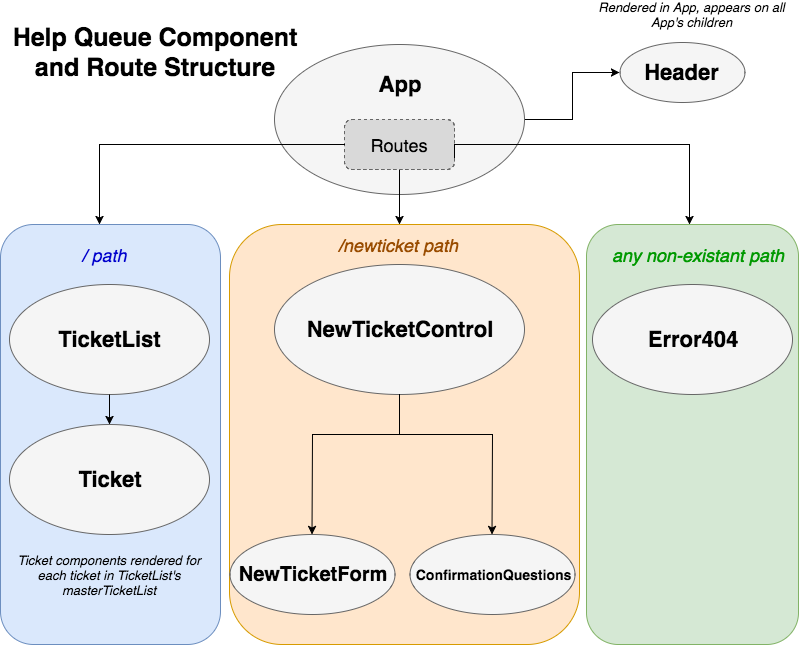

# React Tap Room

#### Epicodus React project #1, 9/7/2018

#### By Kevin Ahn

## Description

A web app to have a virtual tap room to see which drinks are on tap.  
Differences in development between React and Angular:  
* In Angular, you can easily make a template with ``ng new [project name]``
* In React, you can use CSS objects
* In React, you can write using JSX, in Angular, you can write in TypeScript
* React utilizes the virtual DOM so it is faster

## Component Structure  

## User Stories

* As a patron, I want to see a list/menu of all available kegs. For each keg, I need to see its name, brand, price and alcoholContent.
* As an employee, I want to fill out a form when I tap a new keg to add it to the list.
* As an employee, I want the option to edit a keg's properties after entering them just in case I make a mistake.
* As a patron and/or employee, I want to see how many pints are left in a keg. (Hint: A full keg has roughly 124 pints).
* As an employee, I want to be able to click a button next to a keg whenever I sell a pint of it. This should decrease the number of pints left by 1.
* As an employee, I want to be able to see kegs with less than 10 pints left so I can be ready to change them.
* As a patron, I want to have kegs prices to be color-coded for easy readability. Perhaps based on their price (greater or less than $5 per pint, perhaps) or the particular style of beer or kombucha.
* As a patron, I want to use the alcohol content property to display stronger beers differently than weaker beers.

## Setup on OSX

* Install Node.js
* Clone the repo
* `npm install` installs dependencies
* `yarn run start start` starts the development server on localhost:3000
* `yarn run build` bundles the app into static files for production
* `yarn run test` starts the test runner

## Contribution Requirements

1. Clone the repo
1. Make a new branch
1. Commit and push your changes
1. Create a PR

## Technologies Used

* JavaScript
* React
* Node.js
* jQuery 3.3.1
* Bootstrap 4.1.3
* Babel
* Webpack
* ESLint
* Jasmine
* Karma

## Links

* [Github Repo] (https://github.com/kevinahn7/react-tap-room)

## Notes

The biggest difference from the beginning is that Angular is a framework and React is a library. So Angular helps you with setup and React does not as much.  
What is the easiest way to use CSS across components.  

## License

This software is licensed under the MIT license.

Copyright (c) 2018 **Kevin Ahn**